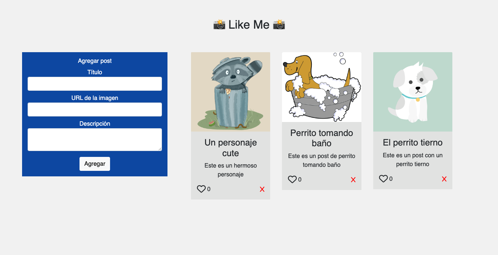

# Like Me! - Desafío

Este desafío pone a prueba los conocimientos sobre node.js,
express y el uso de pg para conectarse a una base de datos PostgreSQL.

El desafío está dividido en dos partes, la primera parte queda explicada
en el siguiente archivo PDF:

- [Parte I](desafio_parte_uno.pdf) - Desafío "Like Me!"

## Para desplegar en local

Este proyecto está configurado para usar Node v18 en adelante.
Para ejecutar en desarrollo de manera local siga estos paso a continuación:

- Clonar el repositorio.

```bash
git clone https://github.com/felipejoq/node-express-pg-challenge.git
```

- Posicionarse en la carpeta del proyecto

```bash
cd node-express-pg-challenge
```

- Copiar el archivo env.template en un archivo .env

```bash
cp .env.template .env
```

- Completar las variables de entorno en el archivo .env, todas son requeridas:

```dotenv
PGUSER=
PGHOST=
PGPASSWORD=
PGDATABASE=
PGPORT=
```

- Instalar los paquetes de node

```bash
npm install
```

- Ejecutar el comando dev

```bash
npm run dev
```

- Visitar localhost:3000

Visitar http://localhost:3000/ o según el puerto que configuró en el archivo .env del proyecto
Se dispone en la ruta raíz de un front en react.js para interactuar con el back-end.


### Vista previa

